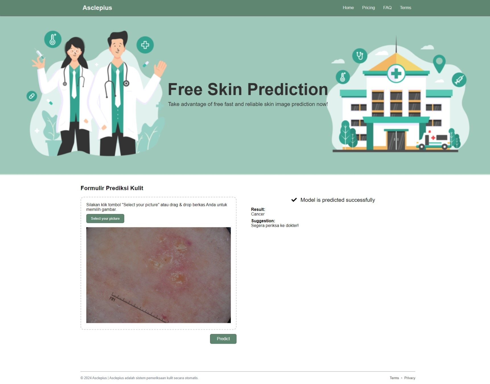
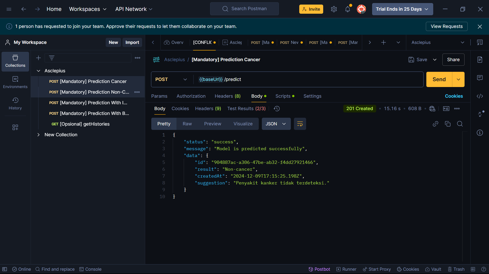

# Asclepius Cancer Prediction API

> A web for cancer prediction using machine learning

Built with a bunch of things, but to name a few :

- [front-end](https://github.com/dicodingacademy/asclepius)
- [Hapi.js](https://hapijs.com/)
- [Node.js](https://nodejs.org/)
- [Cloudrun](https://cloud.google.com/run)
- [App Engine](https://cloud.google.com/appengine)

## Setup

1. Clone the repository
2. use `wsl` and install dependensi :
- Tensorflow js
- Node.js 
- Hapi.js, an din JSON file
3. Configure your `.env` file and cloud config.
4. `npm run dev`
5. Use Postman and import postman file.

## Preview App

